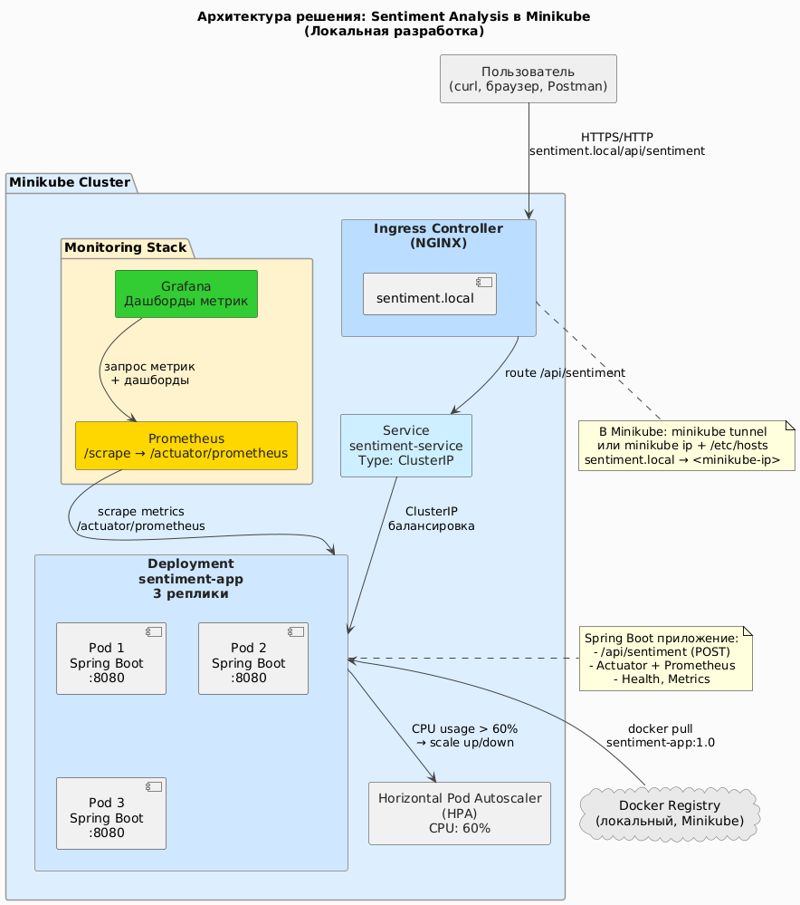

# Оркестрация и контейнеризация. Итоговый проект

**"Разработка и развертывание контейнерного Java-приложения с ИИ-анализом тональности в Minikube с мониторингом и
обзором тенденций"**

# 1. Введение

Цель работы - разработать простое Java-приложение с REST API, реализующее базовый анализ тональности текста,
контейнеризировать его с помощью Docker и развернуть в локальном кластере Minikube.

В рамках задания необходимо:

- создать и запустить кластер Minikube;
- собрать Docker-образ Java-приложения размером менее 150 MB;
- развернуть приложение в Kubernetes с использованием Deployment (3 реплики), Service типа LoadBalancer, Ingress и HPA;
- настроить мониторинг с использованием Prometheus и Grafana;
- выполнить аналитический обзор современных публикаций по теме AI и контейнеризации (минимум 3 статьи arxiv.org);
- подготовить отчёт и презентацию.

Работа фокусируется на практическом применении DevOps-технологий и понимании механизмов развертывания cloud-native
сервисов.

# 2. Архитектура решения

## 2.1. Общая структура

Архитектура решения состоит из следующих компонентов:

- **Java-приложение (Spring Boot)** - предоставляет REST-API `/api/sentiment`.
- **Docker-образ** - собирается через multi-stage сборку и минимизирован с помощью jlink.
- **Minikube Kubernetes Cluster** - платформа для деплоя.
- **Deployment (3 реплики)** - гарантирует высокую доступность.
- **Service (LoadBalancer)** - обеспечивает сетевой доступ.
- **Ingress** - предоставляет публичный доступ по доменному имени.
- **Horizontal Pod Autoscaler (HPA)** - автоматическое масштабирование по CPU.
- **Prometheus + Grafana** - мониторинг и визуализация метрик.



# 3. Развёртывание

## 3.1. Подготовка инфраструктуры

### Установка Minikube

Команды установки:

```
curl -LO https://storage.googleapis.com/minikube/releases/latest/minikube-linux-amd64
sudo install minikube-linux-amd64 /usr/local/bin/minikube
```

Запуск кластера:

```
minikube start --cpus=4 --memory=8192mb --nodes=2
minikube addons enable ingress
minikube addons enable metrics-server
```

Проверка состояния:

```
kubectl get nodes
kubectl get pods -A
```

## 3.2. Контейнеризация Java-приложения

Реализован REST-контроллер:

```
GET /api/sentiment?text=hello → {"sentiment": "positive"}
```

Фрагмент кода контроллера:

```java
package com.example.micrometerdemo.web;

import org.springframework.web.bind.annotation.GetMapping;
import org.springframework.web.bind.annotation.RequestMapping;
import org.springframework.web.bind.annotation.RequestParam;
import org.springframework.web.bind.annotation.RestController;

import java.util.Map;

@RestController
@RequestMapping("/api")
public class SentimentController {

	@GetMapping("/sentiment")
	public Map<String, String> analyzeSentiment(@RequestParam("text") String text) {
		String normalized = text.toLowerCase();

		String sentiment;
		if (normalized.contains("bad") || normalized.contains("hate")) {
			sentiment = "negative";
		} else if (normalized.contains("great") || normalized.contains("love") || normalized.contains("good")) {
			sentiment = "positive";
		} else {
			sentiment = "neutral";
		}

		return Map.of("sentiment", sentiment);
	}
}

```

Docker-образ собран с использованием минимального JRE через jlink.

```dockerFile
# ===== Stage 1: Сборка JAR + кастомный JRE =====
FROM eclipse-temurin:17-jdk-alpine AS builder
WORKDIR /app
COPY pom.xml .
RUN apk add --no-cache maven && \
	mvn -q dependency:go-offline -B
COPY src ./src
RUN mvn -q package -DskipTests -B
RUN jlink \
	--module-path /opt/java/openjdk/jmods \
	--add-modules java.base,java.logging,java.xml,java.sql,java.naming,java.desktop,java.management,java.security.jgss,java.instrument,jdk.httpserver,jdk.unsupported \
	--output /opt/jre-min \
	--compress=2 \
	--no-header-files \
	--no-man-pages

# ===== Stage 2: Финальный образ (alpine + кастомный JRE + JAR) =====
FROM alpine:3.20
WORKDIR /app
COPY --from=builder /opt/jre-min /opt/jre-min
COPY --from=builder /app/target/micrometer-demo-0.1.0-SNAPSHOT.jar /app/app.jar
RUN addgroup -S appgroup && adduser -S appuser -G appgroup && \
	chown -R appuser:appgroup /app
USER appuser
ENV PATH="/opt/jre-min/bin:${PATH}"
EXPOSE 8080
ENTRYPOINT ["java", "-jar", "/app/app.jar"]

```

Команды:

```
eval $(minikube docker-env)
docker build -t sentiment-app:1.0 .
docker images sentiment-app:1.0
```

## 3.3. Развёртывание в Kubernetes

### Применение ресурсов

```
kubectl apply -f namespace.yaml
kubectl apply -f deployment.yaml
kubectl apply -f service.yaml
kubectl apply -f ingress.yaml
kubectl apply -f hpa.yaml
```

Проверка:

```
kubectl get deploy -n app
kubectl get pods -n app
kubectl get svc -n app
kubectl get ingress -n app
kubectl get hpa -n app
```

### Доступ через Ingress

Добавлена запись в `/etc/hosts`:

```
192.168.xx.xx sentiment.local
```

Проверка доступа:

```
curl "http://sentiment.local/api/sentiment?text=I%20love%20kubernetes"
```

# 4. Мониторинг

## 4.1. Установка Prometheus и Grafana

Использован Helm-чарт kube-prometheus-stack:

```
helm repo add prometheus-community https://prometheus-community.github.io/helm-charts
helm repo update
helm install prometheus prometheus-community/kube-prometheus-stack \
  -n monitoring --create-namespace
```

Проверка:

```
kubectl get pods -n monitoring
```

![[Pasted image 20251115202456.png]]

## 4.2. Настройка сбора метрик приложения

Применён ServiceMonitor:

```yaml
spec:
  selector:
  matchLabels:
    app: sentiment-app
    namespaceSelector:
  matchNames:
    - app
    endpoints:
    - port: http
      path: /actuator/prometheus
```

Проверка:

```
kubectl port-forward -n monitoring svc/prometheus-kube-prometheus-prometheus 9090:9090
```

Панель Targets:
`3/3 UP` - метрики успешно собираются.

## 4.3. Grafana

Доступ:

```
kubectl port-forward -n monitoring svc/prometheus-grafana 3000:80
```

Пример базовых панелей:

- HTTP RPS
- JVM memory
- CPU usage per pod
