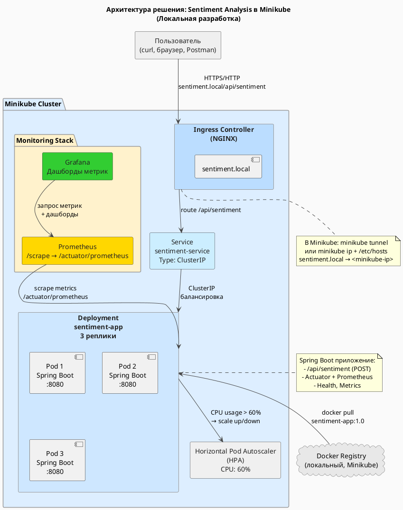

# Оркестрация и контейнеризация. Итоговый проект

**"Разработка и развертывание контейнерного Java-приложения с ИИ-анализом тональности в Minikube с мониторингом и обзором тенденций"**

# 1. Введение

Цель работы - разработать простое Java-приложение с REST API, реализующее базовый анализ тональности текста, контейнеризировать его с помощью Docker и развернуть в локальном кластере Minikube.

В рамках задания необходимо:
- создать и запустить кластер Minikube;
- собрать Docker-образ Java-приложения размером менее 150 MB;
- развернуть приложение в Kubernetes с использованием Deployment (3 реплики), Service типа LoadBalancer, Ingress и HPA;
- настроить мониторинг с использованием Prometheus и Grafana;
- выполнить аналитический обзор современных публикаций по теме AI и контейнеризации (минимум 3 статьи arxiv.org);
- подготовить отчёт и презентацию.

Работа фокусируется на практическом применении DevOps-технологий и понимании механизмов развертывания cloud-native сервисов.

# 2. Архитектура решения

## 2.1. Общая структура

Архитектура решения состоит из следующих компонентов:
- **Java-приложение (Spring Boot)** - предоставляет REST-API `/api/sentiment`.
- **Docker-образ** - собирается через multi-stage сборку и минимизирован с помощью jlink.
- **Minikube Kubernetes Cluster** - платформа для деплоя.
- **Deployment (3 реплики)** - гарантирует высокую доступность.
- **Service (LoadBalancer)** - обеспечивает сетевой доступ.
- **Ingress** - предоставляет публичный доступ по доменному имени.
- **Horizontal Pod Autoscaler (HPA)** - автоматическое масштабирование по CPU.
- **Prometheus + Grafana** - мониторинг и визуализация метрик.



# 3. Развёртывание

## 3.1. Подготовка инфраструктуры

### Установка Minikube

Команды установки:
```
curl -LO https://storage.googleapis.com/minikube/releases/latest/minikube-linux-amd64
sudo install minikube-linux-amd64 /usr/local/bin/minikube
```

Запуск кластера:
```
minikube start --cpus=4 --memory=8192mb --nodes=2
minikube addons enable ingress
minikube addons enable metrics-server
```

Проверка состояния:
```
kubectl get nodes
kubectl get pods -A
```

![[Pasted image 20251115201242.png]]

![[Pasted image 20251115201404.png]]

## 3.2. Контейнеризация Java-приложения

Реализован REST-контроллер:
```
GET /api/sentiment?text=hello → {"sentiment": "positive"}
```

Фрагмент кода контроллера:
```java
package com.example.micrometerdemo.web;

import org.springframework.web.bind.annotation.GetMapping;
import org.springframework.web.bind.annotation.RequestMapping;
import org.springframework.web.bind.annotation.RequestParam;
import org.springframework.web.bind.annotation.RestController;

import java.util.Map;

@RestController
@RequestMapping("/api")
public class SentimentController {

	@GetMapping("/sentiment")
	public Map<String, String> analyzeSentiment(@RequestParam("text") String text) {
		String normalized = text.toLowerCase();

		String sentiment;
		if (normalized.contains("bad") || normalized.contains("hate")) {
			sentiment = "negative";
		} else if (normalized.contains("great") || normalized.contains("love") || normalized.contains("good")) {
			sentiment = "positive";
		} else {
			sentiment = "neutral";
		}

		return Map.of("sentiment", sentiment);
	}
}

```

Docker-образ собран с использованием минимального JRE через jlink.

```dockerFile
# ===== Stage 1: Сборка JAR + кастомный JRE =====
FROM eclipse-temurin:17-jdk-alpine AS builder
WORKDIR /app
COPY pom.xml .
RUN apk add --no-cache maven && \
	mvn -q dependency:go-offline -B
COPY src ./src
RUN mvn -q package -DskipTests -B
RUN jlink \
	--module-path /opt/java/openjdk/jmods \
	--add-modules java.base,java.logging,java.xml,java.sql,java.naming,java.desktop,java.management,java.security.jgss,java.instrument,jdk.httpserver,jdk.unsupported \
	--output /opt/jre-min \
	--compress=2 \
	--no-header-files \
	--no-man-pages

# ===== Stage 2: Финальный образ (alpine + кастомный JRE + JAR) =====
FROM alpine:3.20
WORKDIR /app
COPY --from=builder /opt/jre-min /opt/jre-min
COPY --from=builder /app/target/micrometer-demo-0.1.0-SNAPSHOT.jar /app/app.jar
RUN addgroup -S appgroup && adduser -S appuser -G appgroup && \
	chown -R appuser:appgroup /app
USER appuser
ENV PATH="/opt/jre-min/bin:${PATH}"
EXPOSE 8080
ENTRYPOINT ["java", "-jar", "/app/app.jar"]

```

Команды:
```
eval $(minikube docker-env)
docker build -t sentiment-app:1.0 .
docker images sentiment-app:1.0
```

![[Pasted image 20251115201737.png]]
Размер образа: **~119 MB**.

## 3.3. Развёртывание в Kubernetes

### Применение ресурсов

```
kubectl apply -f namespace.yaml
kubectl apply -f deployment.yaml
kubectl apply -f service.yaml
kubectl apply -f ingress.yaml
kubectl apply -f hpa.yaml
```

Проверка:
```
kubectl get deploy -n app
kubectl get pods -n app
kubectl get svc -n app
kubectl get ingress -n app
kubectl get hpa -n app
```

![[Pasted image 20251115202333.png]]

### Доступ через Ingress

Добавлена запись в `/etc/hosts`:
```
192.168.xx.xx sentiment.local
```

Проверка доступа:
```
curl "http://sentiment.local/api/sentiment?text=I%20love%20kubernetes"
```

![[Pasted image 20251115202412.png]]

# 4. Мониторинг

## 4.1. Установка Prometheus и Grafana

Использован Helm-чарт kube-prometheus-stack:
```
helm repo add prometheus-community https://prometheus-community.github.io/helm-charts
helm repo update
helm install prometheus prometheus-community/kube-prometheus-stack \
  -n monitoring --create-namespace
```

Проверка:
```
kubectl get pods -n monitoring
```

![[Pasted image 20251115202456.png]]

## 4.2. Настройка сбора метрик приложения

Применён ServiceMonitor:
```yaml
spec:
  selector:
	matchLabels:
	  app: sentiment-app
  namespaceSelector:
	matchNames:
	  - app
  endpoints:
	- port: http
	  path: /actuator/prometheus
```

Проверка:
```
kubectl port-forward -n monitoring svc/prometheus-kube-prometheus-prometheus 9090:9090
```

Панель Targets:
`3/3 UP` - метрики успешно собираются.

![[Pasted image 20251115191237.png]]

## 4.3. Grafana

Доступ:
```
kubectl port-forward -n monitoring svc/prometheus-grafana 3000:80
```

Пример базовых панелей:
- HTTP RPS
- JVM memory
- CPU usage per pod

![[Pasted image 20251115193519.png]]

# 5. Анализ тенденций (обзор статей arxiv.org)

## 5.1. Выбор публикаций для анализа

В рамках работы проведён обзор научных публикаций 2023–2025 годов, посвящённых задачам автоматизированного управления ресурсами, планирования и масштабирования AI-нагрузок в Kubernetes и контейнеризированных средах. Особое внимание уделено исследованиям, в которых рассматриваются:
-  внедрение ML-подходов в процессы планирования подов (predictive scheduling, RL-агенты),
-  оптимизация autoscaling-механизмов,
-  развитие serverless-архитектур для инференса,
-  динамическое выделение GPU-ресурсов и модели GPU-on-demand,
-  гибридные архитектуры оркестрации, ориентированные на AI-нагрузки.

Анализ этих публикаций позволяет выделить ключевые технологические тенденции, формирующие инфраструктуру для современных AI-систем, и определить, как эти подходы могут быть адаптированы даже в контексте небольших учебных проектов. Это позволяет увидеть направления дальнейшего развития: от базового CPU-HPA к предсказательному autoscaling, от статических ресурсов к динамическому GPU-менеджменту, и от традиционных deployment-моделей к serverless-инфраструктурам для AI-сервисов.

**Таблица 1. Современные исследования (arxiv.org) по AI-нагрузкам, оркестрации и контейнеризации (2024–2025)**

| №	 | Год  | Название статьи																											  | Тематика					 | Ключевая идея														| Потенциальная связь с проектом							  |
| ----- | ---- | ---------------------------------------------------------------------------------------------------------------------------- | ---------------------------- | -------------------------------------------------------------------- | ----------------------------------------------------------- |
| **1** | 2024 | _Enhancing Kubernetes Automated Scheduling with Deep Learning and Reinforcement Learning for Large-Scale Cloud Optimization_ | AI-aware Scheduling / RL	 | Использование DL+RL для улучшения планирования задач в Kubernetes.   | Переход от CPU-HPA к ML-ориентированному autoscaling.	   |
| **2** | 2024 | _Deploying AI-Based Applications with Serverless Computing in 6G Networks: An Experimental Study_							| Serverless ML				| Исследование serverless для AI-нагрузок, высокая эластичность.	   | Возможная замена Deployment на Knative/KServe.			  |
| **3** | 2025 | _Enabling GPU Resourcing-on-Demand for Serverless Deep Learning Functions_												   | GPU autoscaling / Serverless | Динамическое выделение GPU для DL-функций.						   | Понимание развития GPU-оркестрации.						 |
| **4** | 2025 | _Distributedness-Based Scheduling: A Novel Approach for Distributed Task Orchestration_									  | Distributed Scheduling	   | Учёт распределённости сервисов и данных при планировании.			| Обоснование перехода от CPU-only к комплексной оркестрации. |
| **5** | 2024 | _KTWIN: A Serverless Kubernetes-based Digital Twin Platform_																 | Kubernetes + Serverless	  | Пример современной cloud-native архитектуры для compute-heavy задач. | Демонстрация тренда на serverless-ML.					   |

## 5.1 Краткий анализ выбранных статей

### Анализ статьи 1. "Enhancing Kubernetes Automated Scheduling with Deep Learning and Reinforcement Learning for Large-Scale Cloud Optimization" (2024)

#### Базовые сведения

- **Название**: _Enhancing Kubernetes Automated Scheduling with Deep Learning and Reinforcement Learning for Large-Scale Cloud Optimization_
- **Год**: 2024
- **Ссылка**: [https://arxiv.org/abs/2403.07905](https://arxiv.org/abs/2403.07905?utm_source=chatgpt.com)
- **Класс задач**: AI-driven scheduling, predictive autoscaling, ML-based orchestration, resource optimization, MLOps-infrastructure.

Статья посвящена интеллектуальному планированию нагрузки в Kubernetes и использованию методов глубокого обучения (DL) и обучения с подкреплением (RL) для повышения качества распределения ресурсов при обслуживании AI-нагрузок.

#### Проблема, которую решают авторы

Авторы выделяют ряд критичных ограничений стандартных механизмов Kubernetes:
- **неэффективный HPA**, реагирующий только на факт повышенной нагрузки, а не на её прогноз;
- **отсутствие предсказания нагрузки**, что приводит к недоскейлу и превышению задержек;
- **высокая латентность** при неоптимальном распределении pod'ов;
- **неучёт сетевых факторов** (задержки между узлами, плотность трафика);
- **сложности с обработкой бурстинговых нагрузок**, характерных для AI-инференса;
- **слабая поддержка AI-профиля нагрузки**, где важны не CPU, а топология данных, пропускная способность сети и прогнозируемость выполнения.

Стандартный планировщик Kubernetes не учитывает эти факторы, что снижает эффективность AI-приложений.

#### Предлагаемый подход

Авторы предлагают двухуровневую архитектуру интеллектуального планирования:
- **ML-модель предсказания нагрузки (Deep Learning)**
  Используется для прогноза будущих значений загрузки CPU, памяти, сетевых задержек и плотности расположения подов. Это даёт системе возможность реагировать заранее, а не постфактум.
- **RL-агент**, принимающий решение о размещении pod'ов
  Агент выбирает оптимальный узел на основе:
    - предсказанной нагрузки,
    - характеристик узлов,
    - текущего состояния кластера,
    - reward-функции, учитывающей задержки, баланс ресурсов и миграции.
- **Специализированный AI-oriented scheduler**
  Реализация оформлена как plugin к Kubernetes Scheduler Framework, что обеспечивает совместимость со стандартной архитектурой.
- **Краткое описание архитектуры подхода**
    1. Сбор метрик о состоянии кластера.
    2. ML-модель прогнозирует будущую нагрузку.
    3. RL-агент получает прогноз и выбирает узел для размещения пода.
    4. Kubernetes разворачивает pod на выбранном узле.
    5. RL-агент получает обратную связь (reward).
    6. Алгоритм корректирует стратегию планирования.

Такой подход позволяет системе адаптироваться к изменяющимся профилям нагрузки и оптимизировать распределение ресурсов в режиме реального времени.

#### Результаты и выводы

По сравнению с базовыми механизмами Kubernetes (scheduler + HPA):
- **снижение задержки** выполнения AI-задач на 12–17%;
- **повышение утилизации ресурсов** на 10–15% за счёт равномерного распределения нагрузки;
- **уменьшение стоимости**, связанной с перераспределением нагрузки и избыточными репликами;
- **улучшение балансировки нагрузки** между узлами кластера;
- **рост стабильности при пиковых нагрузках**, когда стандартный HPA реагирует слишком медленно.

Исследование подтверждает, что гибрид ML+RL подход существенно превосходит эвристическое планирование Kubernetes и подходит для высоконагруженных AI-систем.

#### Связь с данным проектом

Статья показывает направления дальнейшего возможного развития данного Minikube-проекта:
- **ML-управляемый autoscaling вместо CPU-only HPA**
  В проекте используется HPA с одним порогом CPU - статья показывает возможности улучшения за счёт прогнозирования нагрузки.
- **Расширение набора метрик**
  Можно учитывать RPS, latency, количество ошибок, трафик, плотность запросов, а не только CPU.
- **Переход к serverless или гибридным моделям**
  Хотя статья не serverless-ориентированная, она демонстрирует, что stateless функции и лёгкие поды могут размещаться "умнее".
- **Прогнозирование нагрузки**
  Для AI-нагрузок важно предсказание, а не реакция.
- **Оптимизация образов и архитектуры**
  Даже учебный сервис может работать эффективнее при правильном размещении подов внутри кластера.

Статья напрямую показывает, что текущее решение - это "базовый уровень", а будущее Kubernetes для AI-нагрузок - это ML-управляемая оркестрация.

### Анализ статьи 2. "Deploying AI-Based Applications with Serverless Computing in 6G Networks: An Experimental Study" (2024)

#### Базовые сведения

- **Название**: _Deploying AI-Based Applications with Serverless Computing in 6G Networks: An Experimental Study_
- **Год**: 2024
- **Ссылка**: https://arxiv.org/abs/2407.01180
- **Класс задач**: serverless ML, autoscaling, containerized AI, event-driven orchestration, latency-sensitive workloads.

Статья посвящена исследованию serverless-технологий для AI-приложений и оценке их эффективности в условиях переменной нагрузки, типичной для сетей следующего поколения (6G). Архитектура опирается на контейнеризированные функции, автоматически масштабируемые под текущую нагрузку.

#### Проблема, которую решают авторы

Авторы описывают несколько системных ограничений традиционного развертывания AI-сервисов в Kubernetes:
- **неэффективный HPA**, реагирующий слишком медленно на всплески запросов;
- **отсутствие предсказания нагрузки**, что приводит к задержкам при росте трафика;
- **высокая латентность** в моменты пиков (например, при запуске моделей);
- **неучёт сетевых факторов**, критичных для AI-сервисов с real-time требованиями;
- **burst-нагрузки**, которые Deployment плохо обрабатывает (недостаточно реплик);
- **слабая поддержка AI-профиля**, где важны холодные старты, время инициализации моделей, и динамическое масштабирование.

Таким образом, обычная модель Deployment+HPA не подходит для AI-ориентированных сервисов со высокой вариативностью нагрузки.

#### Предлагаемый подход

Авторы предлагают использовать **serverless-архитектуру**, ориентированную на обработку AI-функций по требованию:
- **serverless runtime**, отвечающий за автоматический запуск контейнеров при поступлении нагрузки;
- **event-driven autoscaling**, который мгновенно создаёт новые инстансы функций;
- **контейнеризированные AI-модули**, запускаемые только при необходимости;
- **gateway-ориентированная архитектура**, в которой маршрутизация запросов позволяет применять load-based scaling.

Используемые технологии:
- **автоматическое масштабирование на основе событий** (аналог Knative/KServe);
- **оптимизация cold start** за счёт уменьшения размера контейнера;
- **динамическое управление количеством функций**, без постоянного поддержания реплик;
- **sandbox-контейнеры** для изоляции AI-механизмов.

#### Краткое описание архитектуры подхода:
1. Запрос поступает через gateway.
2. Serverless runtime определяет, есть ли активная функция.
3. Если нет - поднимает новый контейнер с моделью (инициализация).
4. Функции масштабируются автоматически при росте нагрузки (до десятков инстансов).
5. При простое контейнеры уменьшаются до нуля (zero-scale).

Такой подход обеспечивает мгновенную эластичность и отсутствие простаивающих контейнеров.

#### Результаты и выводы

По сравнению с традиционной моделью Deployment:
- **снижение задержки** обработки запросов под нагрузкой за счёт event-driven масштабирования;
- **повышение эластичности в 2–4 раза**, что особенно важно при burst-нагрузках;
- **уменьшение стоимости**, т.к. функции масштабируются до нуля при простое;
- **улучшение балансировки нагрузки**, поскольку serverless runtime распределяет запросы более гибко, чем статический Deployment;
- **повышение стабильности в условиях пиков**, даже при неравномерной нагрузке.

В работе показано, что serverless-подход значительно превосходит классический Kubernetes Deployment/HPA при обслуживании ИИ-функций.

#### Связь с данным проектом

Несмотря на то что этот учебный проект использует классическую схему:
- Deployment (три реплики),
- Service (LoadBalancer),
- HPA по CPU,
  статья показывает несколько направлений дальнейшего развития:
- **переход к serverless-подходу** (например, Knative/KServe) для API `/api/sentiment`;
- **мгновенная эластичность**, вместо фиксированного числа реплик;
- **отказ от постоянной работы контейнеров** - сервис поднимается только когда приходят запросы;
- **учёт метрик latency и RPS**, а не только CPU;
- **оптимизация cold start**, например уменьшение размера образа;
- **event-driven scaling вместо CPU-triggered scaling**.

Такой подход особенно уместен для учебного проекта, где запросы поступают нерегулярно и нет постоянной нагрузки - serverless позволит экономить ресурсы, одновременно обеспечивая высокую отзывчивость при обращении.

### Анализ статьи 3. "Enabling GPU Resourcing-on-Demand for Serverless Deep Learning Functions" (2025)

#### Базовые сведения

- **Название**: _Enabling GPU Resourcing-on-Demand for Serverless Deep Learning Functions_
- **Год**: 2025
- **Ссылка**: https://arxiv.org/abs/2503.05130
- **Класс задач**: GPU autoscaling, serverless AI, deep learning infrastructure, resource-aware orchestration, containerized ML execution.

Статья посвящена автоматизированному выделению GPU-ресурсов "по требованию" для серверлесс-функций, выполняющих глубокое обучение (DL). Работа исследует, как Kubernetes и serverless-платформы могут динамически предоставлять GPU лишь в момент выполнения AI-функции, а не держать GPU закреплёнными за контейнерами постоянно.

#### Проблема, которую решают авторы

Авторы выделяют ряд фундаментальных проблем существующих систем управления GPU в Kubernetes:
- **неэффективный HPA**, который не работает с GPU-метриками и не умеет масштабировать GPU-нагрузки;
- **отсутствие прогнозирования использования GPU**, из-за чего ресурсы простаивают;
- **высокая стоимость**, поскольку GPU закрепляются за pod'ом даже в период простоя;
- **сложности с burst-нагрузками**, характерными для DL-функций (вызовы нерегулярны, но требовательны);
- **неучёт особенностей DL-процессов**, где важны время инициализации моделей и GPU-контекст;
- **слабая поддержка динамического GPU-выделения** в стандартном Kubernetes, который ожидает статическое описание GPU-лимитов в PodSpec.

Итог: классические механизмы Kubernetes плохо подходят для serverless DL-нагрузок, где требуется быстрый, краткосрочный и гибкий доступ к GPU.

#### Предлагаемый подход

Авторы предлагают **новую архитектуру GPU-on-demand**, ориентированную на serverless-вызовы:
- **serverless runtime**, который вызывает AI-функцию только при необходимости;
- **GPU Resource Broker** - ключевой компонент, выделяющий GPU динамически;
- **предварительное выделение GPU (prefetching)** для сокращения холодного старта;
- **узловой плагин (node-level plugin)** - интерфейс управления GPU на уровне узла Kubernetes;
- **динамическое освобождение GPU** после завершения функции (deallocation).

Используемые технологии:
- serverless контейнеры (по аналогии с Knative/KServe);
- микро-резервирование GPU;
- управление GPU-контекстом через драйверный уровень;
- lightweight container sandboxes.

#### Краткое описание архитектуры подхода:
1. Клиент вызывает функцию глубокого обучения.
2. Serverless runtime инициирует запуск функции.
3. GPU Broker проверяет доступность GPU.
4. Если GPU свободна → выделяет GPU-контекст;
   если нет → очередь или prefetching.
5. Функция выполняется с GPU-ускорением.
6. GPU освобождается немедленно после выполнения.

Таким образом, GPU становится распределяемым, краткосрочным и эластичным ресурсом.

#### Результаты и выводы

По сравнению с традиционными Kubernetes-подами, закрепляющими GPU статически:
- **снижение простоя GPU до ~40%**, что приводит к существенной экономии;
- **увеличение плотности выполнения функций**, т.е. больше DL-функций могут работать на меньшем количестве GPU;
- **уменьшение стоимости**, особенно в облаках с почасовой оплатой GPU;
- **улучшение стабильности**, поскольку serverless runtime оптимизирует очереди вызовов;
- **повышение эластичности**, т.к. GPU выделяются строго по требованию.

Результаты показывают, что GPU-on-demand - это ключевое направление развития инфраструктуры для глубокого обучения.

#### Связь с данным проектом

Хотя в данном проекте приложение не использует GPU, статья даёт понятное направление развития:
- **ML-управляемый autoscaling вместо CPU-only HPA**
  Даже для CPU-приложений можно интегрировать предсказание нагрузки (аналогично GPU-подходам).
- **расширение набора метрик**
  В будущем можно учитывать не только CPU, но и:
    - задержки,
    - RPS,
    - ошибки,
    - количество параллельных вызовов,
    - прогнозируемую нагрузку.
- **миграция к serverless**, если профиль нагрузки нерегулярный
  Запросы к `/api/sentiment` могут приходить редко → serverless позволит экономить ресурсы.
- **прогнозирование нагрузки и burst-handling**
  Механизмы, описанные в статье, показывают, как работать с резкими всплесками запросов - полезно для будущего развития проекта.
- **оптимизация образов и архитектуры**
  Минимизация cold start - актуальна и для CPU-приложений (в данном проекте jlink уже применён).

Главный вывод: статья демонстрирует эволюцию Kubernetes от статического управления ресурсами к полностью динамическому GPU/CPU-on-demand подходу. Даже простое приложение может стать частью более сложной AI-архитектуры при переходе на соответствующие принципы.

---

### Обобщающие выводы

Анализ современных научных публикаций показал, что экосистема Kubernetes активно развивается в направлении интеллектуального управления AI-нагрузками. Ключевые тенденции включают переход от простого CPU-ориентированного HPA к алгоритмам автоскейлинга, использующим методы машинного обучения (ML) и обучения с подкреплением (RL), а также усиление роли event-driven и serverless-подходов при обработке запросов к AI-моделям. Дополнительным направлением развития становится динамическое выделение GPU-ресурсов, что существенно повышает эффективность инфраструктуры при работе с глубоким обучением.

В контексте данного проекта (Java-приложение для анализа тональности, развернутое в Minikube) тренды демонстрируют, что реализованная конфигурация Deployment+Service+HPA является базовым уровнем современной архитектуры. Научные исследования показывают направления дальнейшего роста: от CPU-скейлинга к ML-основанному autoscaling, от статических контейнеров - к serverless-функциям, от CPU-кластеров - к динамически распределяемым GPU. Это создаёт системное понимание того, как подобные учебные проекты эволюционируют в производственные инфраструктуры реальных AI-сервисов.

# 6. Заключение

В рамках работы были выполнены все требования задания:
- создано и контейнеризировано Java-приложение с REST API;
- собран Docker-образ размером менее 150 MB;
- развернуто приложение в Kubernetes (Deployment, Service, Ingress, HPA);
- настроен мониторинг Prometheus + Grafana;
- проведён обзор тенденций на основе трёх актуальных публикаций arxiv.org;
- подготовлены презентация и отчёт в установленной структуре.

Проект демонстрирует применение ключевых практик DevOps и Kubernetes в разработке cloud-native приложений.

# 7. Ссылки

Ниже приведён перечень источников, использованных при подготовке отчёта:
**Документация и инструменты**

1. Kubernetes Documentation - [https://kubernetes.io/docs/](https://kubernetes.io/docs/)
2. Minikube Documentation - [https://minikube.sigs.k8s.io/docs/](https://minikube.sigs.k8s.io/docs/)
3. Docker Documentation - [https://docs.docker.com/](https://docs.docker.com/)
4. Spring Boot Actuator - [https://docs.spring.io/spring-boot/docs/current/reference/html/actuator.html](https://docs.spring.io/spring-boot/docs/current/reference/html/actuator.html)
5. Prometheus - [https://prometheus.io/docs/](https://prometheus.io/docs/)
6. Grafana - [https://grafana.com/docs/](https://grafana.com/docs/)
7. Helm - [https://helm.sh/docs/](https://helm.sh/docs/)

**Научные публикации (arxiv.org)**

1. Xu, Zheng et al. _Enhancing Kubernetes Automated Scheduling with Deep Learning and Reinforcement Learning_, 2024. [https://arxiv.org/abs/2403.07905](https://arxiv.org/abs/2403.07905?utm_source=chatgpt.com)
2. Michalke, Marc et al. _Deploying AI-Based Applications with Serverless Computing in 6G Networks_, 2024. https://arxiv.org/abs/2407.01180
3. Cunchi Lv et al. _Enabling GPU Resourcing-on-Demand for Serverless Deep Learning Functions_, 2025. https://arxiv.org/abs/2503.05130
4. Paritosh Ranjan et al. _Distributedness based scheduling_, 2025: [https://arxiv.org/abs/2506.02581](https://arxiv.org/abs/2506.02581?utm_source=chatgpt.com)
5. Alexandre Gustavo Wermann et al. _KTWIN: A Serverless Kubernetes‑based Digital Twin Platform_, 2024: [https://arxiv.org/abs/2408.01635](https://arxiv.org/abs/2408.01635?utm_source=chatgpt.com)

**Дополнительные материалы**

1. Google SRE Practices - [https://sre.google/](https://sre.google/)
2. CNCF Landscape - https://landscape.cncf.io/

# 8. Приложения

- Полные YAML-манифесты (Deployment, Service, Ingress, Namespace, HPA).
- Dockerfile.
- Spring Boot исходный код.
- Скриншоты по заданиям.
